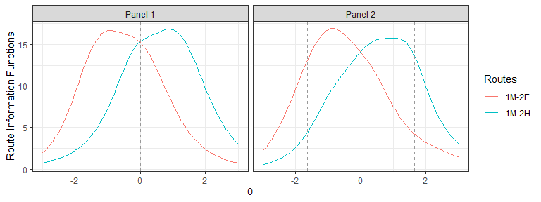
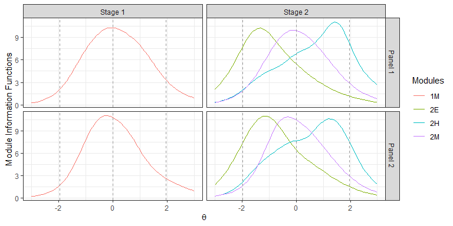
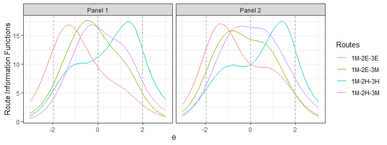
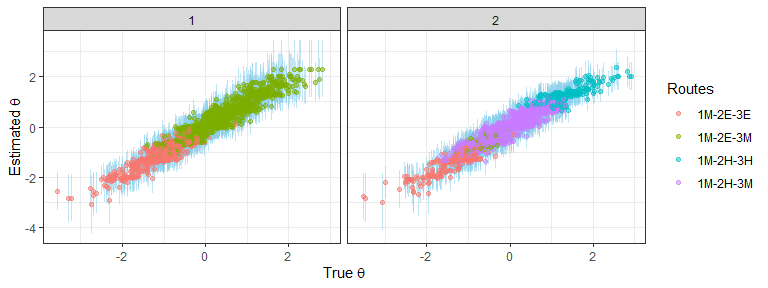

# Rmst: Assemble and Simulate Computerized Adaptive Multistage Tests

<!-- badges: start -->

[](https://cran.r-project.org/package=Rmst)
<!-- badges: end -->

## Overview

Rmst allows uers to use the bottom-up or the top-down approach to
assemble computerized adaptive multistage tests (MSTs). See more details
regarding automated test assembly (ATA) and mixed integer programming
(MIP) in [Rata](https://github.com/xluo11/Rata). After assembling MST
panels, users can simulate the administration of those MST panels, which
is a useful means of evaluating the psychometric and content
characteristics of those panels.

## Installation

Install the stable version from CRAN:

``` r
install.packages("Rmst")
```

Install the most recent version from
[github](https://github.com/xluo11/Rmst):

``` r
devtools::install_github("xluo11/Rmst")
```

## Quickstart

Users would use the following functions to build an ATA model for
assembling MST panels:

  - `mst`: initiate an ATA model for assembling MST panels.
  - `mst_route`: add or remove routes from the MST panel design
  - `mst_objective`: add an absolute or relative objective to the model
  - `mst_constraint`: add categorical and continuous constraints to the
    model
  - `mst_stage_length`: set the limits on the module length in a stage
  - `mst_rdp`: anchor the TIF intersections between two adjacent modules
  - `mst_module_info`: set the minimum and/or maximum values of the
    module information function
  - `mst_assemble`: assemble MST panels using MIP
  - `mst_get_items`: retrieve items from the solved ATA model
  - `plot`: plot the TIF of assembled modules or routes

Use `mst(..., method=)` to choose between the
[top-down](https://doi.org/10.1111/jedm.12174) and the
[bottomp-up](https://link.springer.com/chapter/10.1007%2F0-306-47531-6_6)
approach. In the top-down appraoch, objectives and constraints are added
directly on routes, and thus the `indices` refers to the route index in
the top-down approach and the module index in the bottom-up approach. If
needed, use `mst_objective(..., method=)` and `mst_constraint(...,
method=)` to override the default method in order to implement a hybrid
assembly approach.

## Usage

First, let’s load some packages and write a helper function for
generating item pools. By default, the pool includes 400 3PL items, 20
GPCM items, and 20 GRM items. Each item has a categorical item attribute
(content area) and a continuous attribute (response time).

``` r
library(Rirt)
library(dplyr, warn.conflicts=FALSE)
library(ggplot2, warn.conflicts=FALSE)

item_pool <- function(types=c('3pl', 'gpcm', 'grm'), n_3pl=400, n_gpcm=20, n_grm=20, seed=987653) {
  set.seed(seed)
  items <- model_mixed_gendata(1, n_3pl, n_gpcm, n_grm, n_c=3)$items
  if(n_3pl > 0)
    items$'3pl' <- cbind(items$'3pl', id=1:n_3pl, type='3PL', content=sample(4, n_3pl, replace=TRUE), time=round(rlnorm(n_3pl, 4.0, .28)), group=sort(sample(n_3pl/2, n_3pl, replace=TRUE)))
  if(n_gpcm > 0)
    items$'gpcm' <- cbind(items$'gpcm', id=1:n_gpcm, type='GPCM', content=sample(4, n_gpcm, replace=TRUE), time=round(rlnorm(n_gpcm, 4.0, .28)), group=sort(sample(n_gpcm/2, n_gpcm, replace=TRUE)))
  if(n_grm > 0)
    items$'grm' <- cbind(items$'grm', id=1:n_grm, type='GRM', content=sample(4, n_grm, replace=TRUE), time=round(rlnorm(n_grm, 4.0, .28)), group=sort(sample(n_grm/2, n_grm, replace=TRUE)))
  items[names(items) %in% types]
}
```

#### Example 1: Top-down 1-2 MST

Assemble 2 panels of 1-2 MST using the top-down design approach. Each
route includes 40 items, and no item reuse is allowed. Maximize TIF over
the \[-1.64, 0\] for the route 1M-2E and over \[0, 1.64\] for the route
1M-2H in hopes of covering the regioin \[-1.64, 1.64\] (90% of the
population) jointly with adequate test information.

As for non-statistical constraints, each route is required to have 36
3PL items, 2 GPCM items, and 2 GRM items. Also, each route includes 9 to
11 items in each of the four content domains and has an average response
time of 60 +/- 4 seconds per item.

Solve the model using [lp\_solve](http://lpsolve.sourceforge.net/5.5/)
under a time limit of 5
minutes.

``` r
x <- mst(item_pool(), design='1-2', n_panels=2, method='topdown', test_len=40, max_use=1)
x <- mst_objective(x, seq(-1.64, 0, length.out=3), 'max', indices=1)
x <- mst_objective(x, seq(0,  1.64, length.out=3), 'max', indices=2)
x <- mst_constraint(x, 'type', min=36, max=36, level='3PL')
x <- mst_constraint(x, 'type', min=2, max=2, level='GPCM')
x <- mst_constraint(x, 'type', min=2, max=2, level='GRM')
for(i in 1:4)
  x <- mst_constraint(x, 'content', min=9, max=11, level=i)
x <- mst_constraint(x, 'time', min=56*40, max=64*40)
x <- mst_assemble(x, 'lpsolve', time_limit=60*5)
```

    ## the model is sub-optimal, optimum: 9.791 (12.613, 2.822)

``` r
# Plot the route information functions
plot(x, byroute=TRUE, label=TRUE) +
  geom_vline(xintercept=seq(-1.64, 1.64, length.out=3), linetype=2, color='gray60')
```

<!-- -->

``` r
# Plot the module information functions
plot(x, byroute=FALSE, label=TRUE) +
  geom_vline(xintercept=seq(-1.64, 1.64, length.out=3), linetype=2, color='gray60')
```

<!-- -->

To achieve a more balanced routing distribution, anchor the TIF
intersection of Module 2E and 2M at 0 and solve the model again.

``` r
x <- mst_rdp(x, 0, 2:3, tol=.1)
x <- mst_assemble(x, 'lpsolve', time_limit=60*5)
```

    ## the model is sub-optimal, optimum: 9.24 (12.57, 3.33)

``` r
# Plot the route information functions
plot(x, byroute=TRUE, label=TRUE) +
  geom_vline(xintercept=seq(-1.64, 1.64, length.out=3), linetype=2, color='gray60')
```

<!-- -->

``` r
# Plot the module information functions
plot(x, byroute=FALSE, label=TRUE) +
  geom_vline(xintercept=seq(-1.64, 1.64, length.out=3), linetype=2, color='gray60')
```

<!-- -->

Alternatively, the model can be solved by using
[GLPK](https://www.gnu.org/software/glpk/).

``` r
x_glpk <- mst_assemble(x, 'glpk', time_limit=60*5)
```

    ## time limit exceeded, optimum: 9.227 (13.079, 3.852)

``` r
# Plot the route information functions
plot(x_glpk, byroute=TRUE, label=TRUE) +
  geom_vline(xintercept=seq(-1.64, 1.64, length.out=3), linetype=2, color='gray60')
```

<!-- -->

``` r
# Plot the module information functions
plot(x_glpk, byroute=FALSE, label=TRUE) +
  geom_vline(xintercept=seq(-1.64, 1.64, length.out=3), linetype=2, color='gray60')
```

<!-- -->

Examine the distribution of item type, content domain and average
response time in each panel and route in the lp\_solve solution.

``` r
rs <- NULL
for(p in 1:x$n_panels)
  for(i in 1:x$n_routes) {
    items <- mst_get_items(x, panel_ix=p, route_ix=i)
    item_content <- rowSums(sapply(items, function(x) freq(x$content, 1:4)$freq))
    names(item_content) <- paste('content', 1:4, sep='')
    item_type <- unlist(Map(nrow, items))
    item_time <- mean(unlist(sapply(items, function(x) x$time)))
    rs <- rbind(rs, c(panel=p, route=i, item_content, item_type, time=item_time))
  }
rs
```

    ##      panel route content1 content2 content3 content4 3pl gpcm grm   time
    ## [1,]     1     1       11       10        9       10  36    2   2 56.075
    ## [2,]     1     2       11        9        9       11  36    2   2 57.875
    ## [3,]     2     1       10       10        9       11  36    2   2 56.300
    ## [4,]     2     2        9       10       10       11  36    2   2 56.075

Examine the number of items in each module.

``` r
Map(function(x) mutate(x, module=paste(stage, label, sep='')) %>% 
  select(id, panel, module, type), x$items) %>%
  Reduce(rbind, .) %>% group_by(panel, module) %>%
  summarise(n=n(), n_3pl=sum(type=='3PL'), n_gpcm=sum(type=='GPCM'), n_grm=sum(type=='GRM')) %>%
  as.data.frame()
```

    ##   panel module  n n_3pl n_gpcm n_grm
    ## 1     1     1M 35    33      1     1
    ## 2     1     2E  5     3      1     1
    ## 3     1     2H  5     3      1     1
    ## 4     2     1M 16    14      0     2
    ## 5     2     2E 24    22      2     0
    ## 6     2     2H 24    22      2     0

Let’s simulate the administration of these assembled two MST panels to
3,000 students drawn from the standard normal distribution. After
finishing Stage 1, students are routed to Stage 2 using a fixed point
theta=0.

``` r
true_t <- rnorm(3000, 0, 1)
sims <- Map(function(t) mst_sim(x, t, rdp=list('stage2'=0)), true_t)
rs <- Map(function(xx) {
  cbind(true=xx$true, est=xx$theta, panel=xx$admin$'3pl'$panel[1], se=xx$stats$se[x$n_stages], info=xx$stats$info[x$n_stages],
        route=x$module[xx$stats$route, c('stage', 'label')] %>% apply(., 1, paste, collapse='') %>% paste(., collapse='-'),
        n_items=sum(xx$stats$n_items))
}, sims) %>% Reduce(rbind, .) %>% data.frame(., stringsAsFactors=FALSE)
rs$true <- as.numeric(rs$true) %>% round(., 4)
rs$est <- as.numeric(rs$est) %>% round(., 4)
rs$info <- as.numeric(rs$info) %>% round(., 4)
rs$se <- as.numeric(rs$se) %>% round(., 4)
rs$n_items <- as.integer(rs$n_items)
rs$panel <- paste('Panel', rs$panel)

# Panel usage
freq(rs$panel) %>% mutate(perc=round(perc, 2), cum_perc=round(cum_perc, 2))
```

    ##     value freq perc cum_freq cum_perc
    ## 1 Panel 1 1463 0.49     1463     0.49
    ## 2 Panel 2 1537 0.51     3000     1.00

``` r
# Route usage
freq(rs$route) %>% mutate(perc=round(perc, 2), cum_perc=round(cum_perc, 2))
```

    ##   value freq perc cum_freq cum_perc
    ## 1 1M-2E 1915 0.64     1915     0.64
    ## 2 1M-2H 1085 0.36     3000     1.00

``` r
# Compare true and estimated thetas
with(rs, c(corr=cor(true, est), rmse=rmse(true, est))) %>% round(., 2)
```

    ## corr rmse 
    ## 0.96 0.27

``` r
mutate(rs, lb=est-1.96*se, ub=est+1.96*se) %>%
  ggplot(aes(true, est, ymin=lb, ymax=ub, color=route)) +
  geom_linerange(color='skyblue',alpha=.5) + geom_point(alpha=.5) + facet_wrap(~panel) +
  xlab(expression(paste('True ', theta))) + ylab(expression(paste('Estimated ', theta))) +
  theme_bw() + scale_color_discrete(guide=guide_legend('Routes'))
```

<!-- -->

#### Example 2: Bottom-up 1-3 MST

Assemble 2 panels of 1-3 MST using the bottom-up design approach. Each
module includes 20 items so that each route has 40 items, and no item
reuse is allowed. Maximize TIF over the \[-1.96, -0.65\] for the easy
route (1M-2E), over \[-0.65, 0.65\] for the moderate route (1M-2M), and
over \[0.65, 1.96\] for the hard route (1M-2H). Together, the central
region of the scale from -1.96 to 1.96 which includes 95% of the
populatoin is supplied with high test information.

In addition, each module is required to comply with the following
constraints:

  - 15 3PL items, 2 to 3 GPCM items, and 2 to 3 GRM items
  - 4 to 6 items in each of the four content domains
  - 56 to 64 seconds of response time per item

The model is solved using lp\_solve under a time limit of 5
minutes.

``` r
x <- mst(item_pool(), design='1-3', n_panels=2, method='bottomup', test_len=20, max_use=1)
x <- mst_objective(x, seq(-.65, .65, length.out=3), 'max', indices=c(1,3))
x <- mst_objective(x, seq(-1.96, -0.65, length.out=3), 'max', indices=2)
x <- mst_objective(x, seq(0.65, 1.96, length.out=3), 'max', indices=4)
x <- mst_constraint(x, 'type', min=15, max=15, level='3PL')
x <- mst_constraint(x, 'type', min=2, max=3, level='GPCM')
x <- mst_constraint(x, 'type', min=2, max=3, level='GRM')
for(i in 1:4)
  x <- mst_constraint(x, 'content', min=4, max=6, level=i)
x <- mst_constraint(x, 'time', min=56*20, max=64*20)
x <- mst_assemble(x, 'lpsolve', time_limit=60*5)
```

    ## the model is sub-optimal, optimum: 4.012 (7.436, 3.424)

``` r
# Plot the route functions
plot(x, byroute=TRUE, label=TRUE) +
  geom_vline(xintercept=seq(-1.96, 1.96, length.out=3), linetype=2, color='gray60')
```

<!-- -->

``` r
# Plot the module information functions
plot(x, byroute=FALSE, label=TRUE) +
  geom_vline(xintercept=seq(-1.96, 1.96, length.out=3), linetype=2, color='gray60')
```

<!-- -->

Examine the compliance of the solution with the content constraints.

``` r
Map(function(x) mutate(x, module=paste(stage, label, sep='')) %>% 
  select(id, panel, module, type, content, time), x$items) %>%
  Reduce(rbind, .) %>% group_by(panel, module) %>%
  summarise(n=n(), n_3pl=sum(type=='3PL'), n_gpcm=sum(type=='GPCM'), n_grm=sum(type=='GRM'), 
            time=round(mean(time), 2), content1=sum(content==1), content2=sum(content==2), 
            content3=sum(content==3), content4=sum(content==4)) %>%
  as.data.frame()
```

    ##   panel module  n n_3pl n_gpcm n_grm  time content1 content2 content3
    ## 1     1     1M 20    15      3     2 58.80        6        6        4
    ## 2     1     2E 20    15      3     2 56.65        5        4        6
    ## 3     1     2H 20    15      3     2 59.60        5        4        6
    ## 4     1     2M 20    15      2     3 58.70        6        4        6
    ## 5     2     1M 20    15      2     3 56.15        6        4        4
    ## 6     2     2E 20    15      3     2 56.55        4        6        4
    ## 7     2     2H 20    15      2     3 57.90        6        4        4
    ## 8     2     2M 20    15      2     3 57.50        5        4        6
    ##   content4
    ## 1        4
    ## 2        5
    ## 3        5
    ## 4        4
    ## 5        6
    ## 6        6
    ## 7        6
    ## 8        5

After test assembly, administer the panels to 3,000 students drawn from
the standard normal distribution using the maximum information routing
rule.

``` r
true_t <- rnorm(3000, 0, 1)
sims <- Map(function(t) mst_sim(x, t), true_t)
rs <- Map(function(xx) {
  cbind(true=xx$true, est=xx$theta, panel=xx$admin$'3pl'$panel[1], se=xx$stats$se[x$n_stages], info=xx$stats$info[x$n_stages],
        route=x$module[xx$stats$route, c('stage', 'label')] %>% apply(., 1, paste, collapse='') %>% paste(., collapse='-'),
        n_items=sum(xx$stats$n_items))
}, sims) %>% Reduce(rbind, .) %>% data.frame(., stringsAsFactors=FALSE)
rs$true <- as.numeric(rs$true) %>% round(., 4)
rs$est <- as.numeric(rs$est) %>% round(., 4)
rs$info <- as.numeric(rs$info) %>% round(., 4)
rs$se <- as.numeric(rs$se) %>% round(., 4)
rs$panel <- as.integer(rs$panel)
rs$n_items <- as.integer(rs$n_items)

# Panel usage
freq(rs$panel) %>% mutate(perc=round(perc, 2), cum_perc=round(cum_perc, 2))
```

    ##   value freq perc cum_freq cum_perc
    ## 1     1 1517 0.51     1517     0.51
    ## 2     2 1483 0.49     3000     1.00

``` r
# Route usage
freq(rs$route) %>% mutate(perc=round(perc, 2), cum_perc=round(cum_perc, 2))
```

    ##   value freq perc cum_freq cum_perc
    ## 1 1M-2E  730 0.24      730     0.24
    ## 2 1M-2H  756 0.25     1486     0.50
    ## 3 1M-2M 1514 0.50     3000     1.00

``` r
# Compare true and estimated thetas
with(rs, c(corr=cor(true, est), rmse=rmse(true, est))) %>% round(., 2)
```

    ## corr rmse 
    ## 0.97 0.25

``` r
mutate(rs, lb=est-1.96*se, ub=est+1.96*se) %>%
  ggplot(aes(true, est, ymin=lb, ymax=ub, color=route)) +
  geom_linerange(color='skyblue', alpha=.5) + geom_point(alpha=.5) + facet_wrap(~panel) +
  xlab(expression(paste('True ', theta))) + ylab(expression(paste('Estimated ', theta))) +
  theme_bw() + scale_color_discrete(guide=guide_legend('Routes'))
```

<!-- -->

#### Example 3: Top-down 1-2-3 MST with Reused Items

Assemble 2 panels of 1-2-3 MST using the top-down approach. Two routes
with capricious ability change (1M-2E-3H & 1M-2H-3E) are blocked. Items
are allowed to be used up to four times. Each route needs to meet the
following criteria:

  - Maximize TIF over \[-1.96, -0.64\] for the easy route (1M-2E-3E),
    over \[-0.64, 0.64\] for the moderate routes (1M-2E-3M & 1M-2H-3M),
    and over \[0.64, 1.96\] for the hard route (1M-2H-3H)
  - Include a total of 40 items
  - 34 to 38 3PL items, 1 to 3 GPCM items, and 1 to 3 GRM items
  - 8 to 12 items in each of the four content domains
  - 56 to 64 seconds of response time per item

To yield decent routing accuracy, the first two stages are required to
include at least 8 items. The model is solved by lp\_solve under a time
limit of 5
minutes.

``` r
x <- mst(item_pool(), design='1-2-3', n_panels=2, method='topdown', test_len=40, max_use=4)
x <- mst_route(x, c(1, 2, 6), "-")
x <- mst_route(x, c(1, 3, 4), "-")
x <- mst_objective(x, seq(-1.96, -0.64, length.out=3), 'max', indices=1)
x <- mst_objective(x, seq(-0.64,  0.64, length.out=3), 'max', indices=2:3)
x <- mst_objective(x, seq( 0.64,  1.96, length.out=3), 'max', indices=4)
x <- mst_constraint(x, 'type', min=34, max=38, level='3PL')
x <- mst_constraint(x, 'type', min=1, max=3, level='GPCM')
x <- mst_constraint(x, 'type', min=1, max=3, level='GRM')
for(i in 1:4)
  x <- mst_constraint(x, 'content', min=8, max=12, level=i)
x <- mst_constraint(x, 'time', min=56*40, max=64*40)
x <- mst_stage_length(x, 1:2, min=8)
x <- mst_assemble(x, 'lpsolve', time_limit=60*5)
```

    ## the model is sub-optimal, optimum: 8.258 (12.837, 4.579)

``` r
# Plot the route information functions
plot(x, byroute=TRUE, label=TRUE) +
  geom_vline(xintercept=seq(-1.96, 1.96, length.out=3), linetype=2, color='gray60')
```

<!-- -->

``` r
# Plot the module information functions
plot(x, byroute=FALSE, label=TRUE) +
  geom_vline(xintercept=seq(-1.96, 1.96, length.out=3), linetype=2, color='gray60')
```

<!-- -->

Examine the compliance of the assembly results with the content
constraints.

``` r
rs <- NULL
for(p in 1:x$n_panels)
  for(i in 1:x$n_routes) {
    items <- mst_get_items(x, panel_ix=p, route_ix=i)
    item_content <- rowSums(sapply(items, function(x) freq(x$content, 1:4)$freq))
    names(item_content) <- paste('content', 1:4, sep='')
    item_type <- unlist(Map(nrow, items))
    item_time <- mean(unlist(sapply(items, function(x) x$time)))
    rs <- rbind(rs, c(panel=p, route=i, item_content, item_type, time=item_time))
  }
rs
```

    ##      panel route content1 content2 content3 content4 3pl gpcm grm   time
    ## [1,]     1     1        9       10        9       12  35    3   2 56.450
    ## [2,]     1     2        9        8       12       11  36    2   2 60.025
    ## [3,]     1     3       11       10       10        9  37    2   1 58.400
    ## [4,]     1     4       11       12        8        9  35    2   3 57.100
    ## [5,]     2     1       10        8       10       12  35    3   2 56.850
    ## [6,]     2     2       12       10        9        9  36    2   2 57.500
    ## [7,]     2     3       12       11        8        9  35    2   3 57.825
    ## [8,]     2     4       11       10        8       11  37    1   2 57.825

``` r
Map(function(x) mutate(x, module=paste(stage, label, sep='')) %>% 
  select(id, panel, module, type), x$items) %>%
  Reduce(rbind, .) %>% group_by(panel, module) %>%
  summarise(n=n(), n_3pl=sum(type=='3PL'), n_gpcm=sum(type=='GPCM'), n_grm=sum(type=='GRM')) %>%
  as.data.frame()
```

    ##    panel module  n n_3pl n_gpcm n_grm
    ## 1      1     1M  9     8      1     0
    ## 2      1     2E 12    11      0     1
    ## 3      1     2H 12    12      0     0
    ## 4      1     3E 19    16      2     1
    ## 5      1     3H 19    15      1     3
    ## 6      1     3M 19    17      1     1
    ## 7      2     1M 13    12      0     1
    ## 8      2     2E 14    14      0     0
    ## 9      2     2H 14    13      0     1
    ## 10     2     3E 13     9      3     1
    ## 11     2     3H 13    12      1     0
    ## 12     2     3M 13    10      2     1

Administer the assembled panels to 3,000 students drawn from the
standard normal distribution using the maximum information routing rule.

``` r
# simulation
true_t <- rnorm(3000, 0, 1)
sims <- Map(function(t) mst_sim(x, t), true_t)
rs <- Map(function(xx) {
  cbind(true=xx$true, est=xx$theta, panel=xx$admin$'3pl'$panel[1], se=xx$stats$se[x$n_stages], info=xx$stats$info[x$n_stages],
        route=x$module[xx$stats$route, c('stage', 'label')] %>% apply(., 1, paste, collapse='') %>% paste(., collapse='-'),
        n_items=sum(xx$stats$n_items))
}, sims) %>% Reduce(rbind, .) %>% data.frame(., stringsAsFactors=FALSE)
rs$true <- as.numeric(rs$true) %>% round(., 4)
rs$est <- as.numeric(rs$est) %>% round(., 4)
rs$info <- as.numeric(rs$info) %>% round(., 4)
rs$se <- as.numeric(rs$se) %>% round(., 4)
rs$panel <- as.integer(rs$panel)
rs$n_items <- as.integer(rs$n_items)

# Panel usage
freq(rs$panel) %>% mutate(perc=round(perc, 2), cum_perc=round(cum_perc, 2))
```

    ##   value freq perc cum_freq cum_perc
    ## 1     1 1532 0.51     1532     0.51
    ## 2     2 1468 0.49     3000     1.00

``` r
# Route usage
freq(rs$route) %>% mutate(perc=round(perc, 2), cum_perc=round(cum_perc, 2))
```

    ##      value freq perc cum_freq cum_perc
    ## 1 1M-2E-3E  632 0.21      632     0.21
    ## 2 1M-2E-3M 1169 0.39     1801     0.60
    ## 3 1M-2H-3H  221 0.07     2022     0.67
    ## 4 1M-2H-3M  978 0.33     3000     1.00

``` r
# Compare true and estimated thetas
with(rs, c(corr=cor(true, est), rmse=rmse(true, est))) %>% round(., 2)
```

    ## corr rmse 
    ## 0.96 0.26

``` r
mutate(rs, lb=est-1.96*se, ub=est+1.96*se) %>%
  ggplot(aes(true, est, ymin=lb, ymax=ub, color=route)) +
  geom_linerange(color='skyblue', alpha=.5) + geom_point(alpha=.5) + facet_wrap(~panel) +
  xlab(expression(paste('True ', theta))) + ylab(expression(paste('Estimated ', theta))) +
  theme_bw() + scale_color_discrete(guide=guide_legend('Routes'))
```

<!-- -->

#### Example 4: Use the hybrid assembly approach

Assemble 2 panels of 1-3 MST using a hybrid assembly approach that sets
constraints on routes but test information functions on modules. In
particular, module 1M is required to have a flat TIF of 6 over the
region from -1.28 to 1.28, module 2E, 2M, and 2H to hit the TIF target
of 8 at -1.28, 0, and 1.28 respectively. Additionally, each route is
required to have 4 to 6 items in each content domain and 20 items in
total.

``` r
x <- mst(item_pool(), '1-3', n_panels=2, method='topdown', test_len=20, max_use=1)
x <- mst_objective(x, seq(-1.28, 1.28, length.out=3), target=6, indices=1, method='bottomup')
x <- mst_objective(x, -1.28, target=8, indices=2, method='bottomup')
x <- mst_objective(x,     0, target=8, indices=3, method='bottomup')
x <- mst_objective(x,  1.28, target=8, indices=4, method='bottomup')
for(i in 1:4)
  x <- mst_constraint(x, 'content', min=4, max=6, level=i)
x <- mst_assemble(x, 'lpsolve', time_limit=30)
```

    ## the model is sub-optimal, optimum: 1.869 (0.988, 0.881)

``` r
# plot the route information functions
plot(x, byroute=FALSE, label=TRUE)
```

<!-- -->

``` r
# plot the module information functions
plot(x, byroute=TRUE, label=TRUE)
```

<!-- -->

``` r
# check the content distribution
rs <- NULL
for(p in 1:x$n_panels)
  for(r in 1:x$n_routes){
    x_items <- mst_get_items(x, panel_ix=p, route_ix=r)
    x_content <- Map(function(x) if(is.null(x)) rep(0, 4) else with(x, freq(content, 1:4)$freq), x_items)
    x_content <- colSums(Reduce(rbind, x_content))
    names(x_content) <- paste('content', 1:4, sep='')
    rs <- rbind(rs, c(panel=p, route=r, x_content))
  }
rs
```

    ##      panel route content1 content2 content3 content4
    ## [1,]     1     1        6        6        4        4
    ## [2,]     1     2        5        5        4        6
    ## [3,]     1     3        6        5        4        5
    ## [4,]     2     1        4        6        4        6
    ## [5,]     2     2        4        6        4        6
    ## [6,]     2     3        4        6        4        6

## Getting help

If you encounter a bug, please post a code example that exposes the bug
on [github](https://github.com/xluo11/Rata/issues). You can post your
questions and feature requests on
[github](https://github.com/xluo11/Rata/issues) or to the
[author](mailto:xluo1986@gmail.com).
